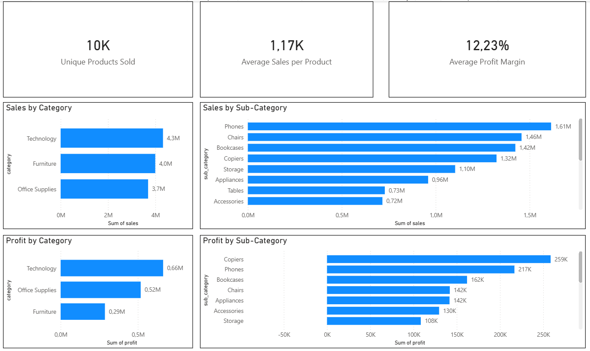
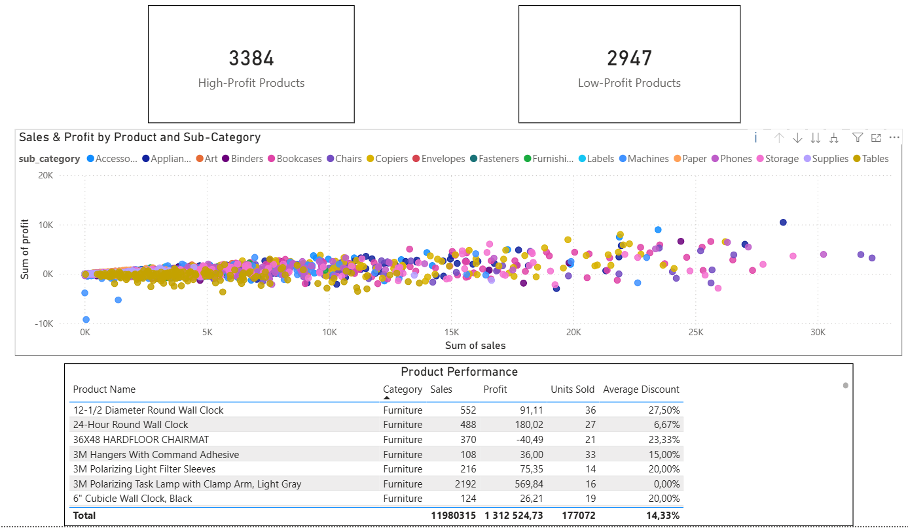
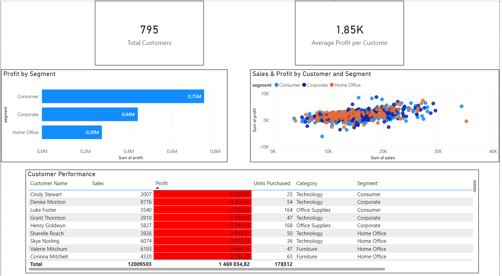
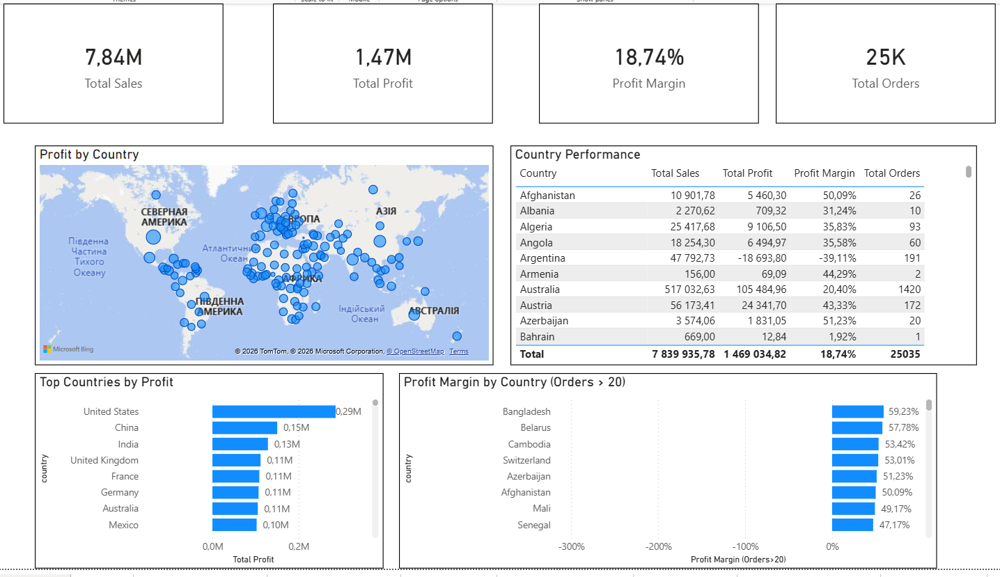
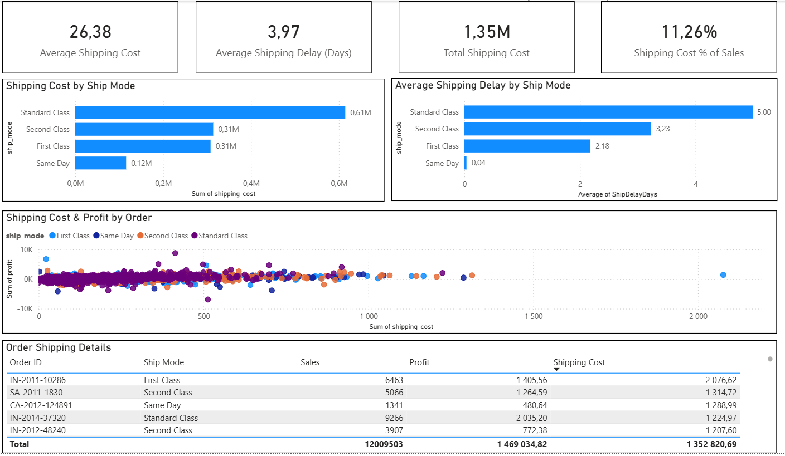
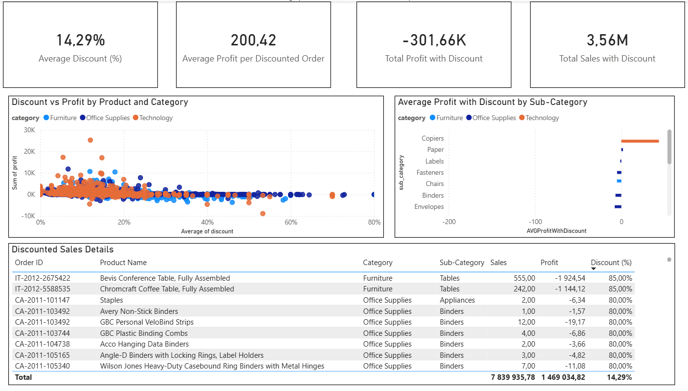
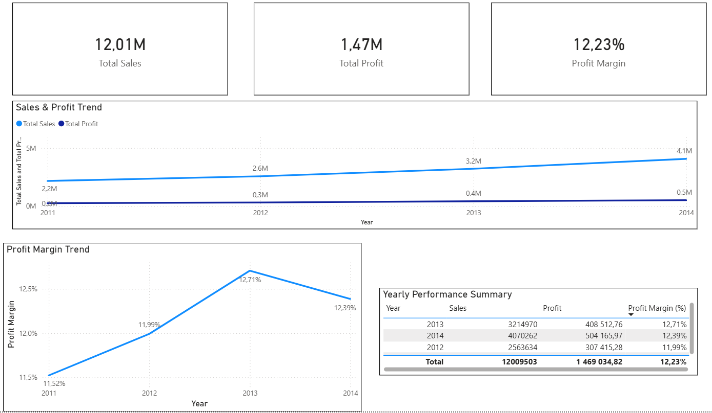
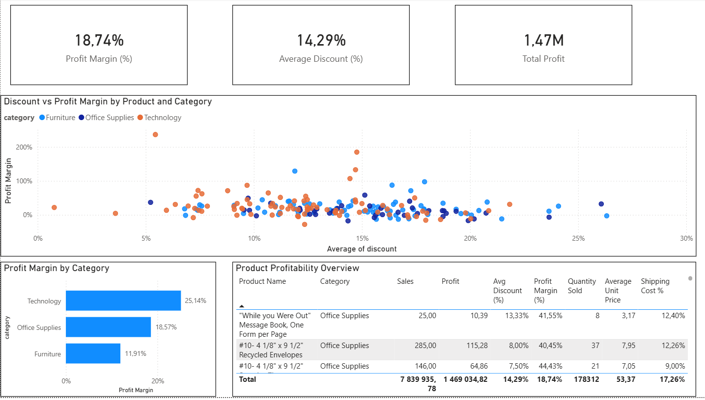

# SuperStore Power BI Analysis

Business intelligence & sales analysis project built in Power BI using the SuperStore dataset.

## Dashboard Preview

##  Project Overview

This project explores sales performance, profitability, customer behavior, discounts, logistics, and geographic trends using interactive Power BI dashboards.

The goal of the analysis is to identify:

- Revenue drivers  
- Profitability issues  
- Discount impact  
- Customer patterns  
- Country performance  
- Time trends  

##  Dashboard Pages

The report includes the following analytical sections:

- **Executive Overview** – Key KPIs and sales distribution  
- **Product & Category Analysis** – Sales & profit structure  
- **Profitability Analysis** – Margin & low-profit detection  
- **Customer Analysis** – Customer value & segmentation  
- **Geographic Analysis** – Country performance  
- **Shipping & Logistics** – Cost & delay analysis  
- **Discount / Promotions** – Discount impact on profit  
- **Time / Trend Analysis** – Year-over-year performance  

##  Key Metrics Used

- Total Sales  
- Total Profit  
- Profit Margin  
- Orders Count  
- Average Order Value (AOV)  
- Average Discount  
- Shipping Cost Metrics  

##  Dataset

The analysis is based on the SuperStore dataset, commonly used for BI and analytics practice.

Main fields include:

- Sales  
- Profit  
- Discount  
- Quantity  
- Category / Sub-Category  
- Customer  
- Country  
- Shipping information  

## 🔎 Analytical Focus

The report helps answer questions such as:

- Which categories drive revenue vs profit?  
- Do discounts improve or destroy margin?  
- Which customers are most valuable?  
- Which countries perform best?  
- How logistics affects profitability?  
- How business metrics evolve over time?  

##  Repository Contents

- `SuperStore_Report.pbix` – Power BI report file  
- Dataset file (CSV / Excel)  

##  How to Open

1. Download the `.pbix` file  
2. Open in **Microsoft Power BI Desktop**  

## Martyn Kovalchuk

Created as a portfolio project for Data / Business Intelligence analysis practice.

